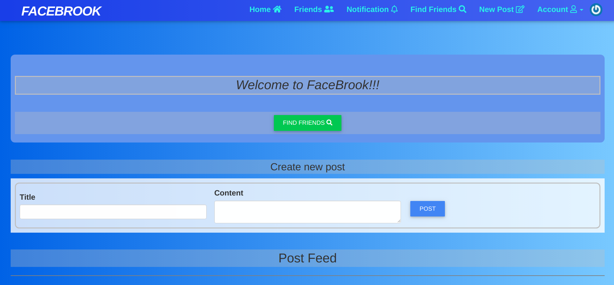
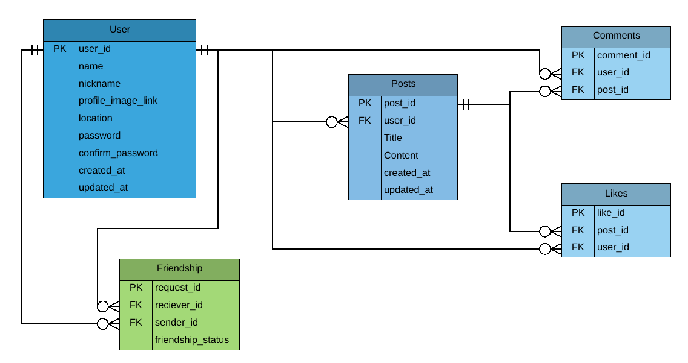

[![Contributors][contributors-shield]][contributors-url]
[![Forks][forks-shield]][forks-url]
[![Stargazers][stars-shield]][stars-url]
[![Issues][issues-shield]][issues-url]
[![MIT License][license-shield]][license-url]

# FaceBrook App
 

  

  <h3 align="center">
	 Project Building Facebook replica [FaceBrook App]
  </h3>

  <h3 align="center">
	 Live Version link - https://brookapp.herokuapp.com/
  </h3>

  

    This project implements the basic functionality found on the popular social media app called Facebook.
    It is a part of the <a href="https://www.theodinproject.com/courses/ruby-on-rails/lessons/final-project">odin project curriculum.</a>
     
    <a href="https://github.com/mikenath223/Project-Building-Facebook/blob/master/README.md"><strong>Explore the docs 📚</strong></a>
     
     
	  🖊️
    <a href="https://www.theodinproject.com/courses/ruby-on-rails/lessons/final-project">Assigment</a>
    🐛
    <a href="https://github.com/mikenath223/Project-Building-Facebook/issues">Report Bug</a>
    🙏
    <a href="https://github.com/mikenath223/Project-Building-Facebook/issues">Request Feature</a>
  

## Project Building FaceBrook App
In this project users can sign up either on the app or through their facebook account and follow other users.
[Facebook](https://www.facebook.com/). The main goal is to put in practice the main concepts of Associations, Authentication with devise gem, and units & integration tests in rails.

# Validations

-Rubocop

# Get Started

* Run `rails db:migrate` to migrate db
* Run tests with `bundle exec rspec <insert file_path here>`
* Run `rails db:seed` to generate seed data.
* Run `rails s` to start rails server
* Go to `localhost:3000` have fun :)

# Features

* Users sign up and send friend          requests to other users.
* Posts are created by users and only     a user's friend can view them.
* Comments can be made on posts.
* Likes can be made by users on posts and comments.
* Postgres databases both for development and production 
* Associates several tables on the database using foreign keys:

* Use of `cookies` and `flash`
* Modify `routes.rb`
* Managed state with data on SqliteDB
* Tests made with [`RSpec`](https://relishapp.com/rspec/)

# Built With

* Passion purple_heart for code.
* `ruby` v2.6.5
* `rails` v6.0.2+
* `vscode` with _Ruby_ and _Rubocop_ extensions
* Linux

# Authors

* [Ukeje Michgolden](https://github.com/mikenath223)
* [Mario E. Delgado](https://github.com/mikenath223)

# License

This project is licensed under the MIT License - see the [LICENSE.md](LICENSE.md) file for details 

<!-- ACKNOWLEDGEMENTS -->
## Acknowledgements
* [Microverse](https://www.microverse.org/)
* [The Odin Project](https://www.theodinproject.com/)

<!-- MARKDOWN LINKS & IMAGES -->
<!-- https://www.markdownguide.org/basic-syntax/#reference-style-links -->
[contributors-shield]: https://img.shields.io/github/contributors/mikenath223/Project-Building-Facebook.svg?style=flat-square
[contributors-url]: https://github.com/mikenath223/Project-Building-Facebook/graphs/contributors
[forks-shield]: https://img.shields.io/github/forks/mikenath223/Project-Building-Facebook
[forks-url]: https://github.com/mikenath223/Project-Building-Facebook/network/members
[stars-shield]: https://img.shields.io/github/stars/mikenath223/Project-Building-Facebook
[stars-url]: https://github.com/mikenath223/Project-Building-Facebook/stargazers
[issues-shield]: https://img.shields.io/github/issues/mikenath223/Project-Building-Facebook
[issues-url]: https://github.com/mikenath223/Project-Building-Facebook/issues
[license-shield]: https://img.shields.io/github/license/mikenath223/Project-Building-Facebook
[license-url]: https://github.com/mikenath223/Project-Building-Facebook/blob/master/LICENSE.txt
